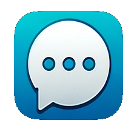

# ChatGPTTalk 

ChatGPTTalk is an iOS application that serves as a demonstration of how to integrate the OpenAI ChatGPT API with speech recognition and text-to-speech modules in iOS. This is an open-source project available for download, modification, and use according to your needs. It is not available on the App Store and is intended as a learning and experimentation resource.

## Features

- **ChatGPT Conversation**: Interact with the ChatGPT chatbot using text messages.
- **Speech Recognition**: Activate the microphone and speak instead of typing. Conclude your input with "OK" to prompt the decoder to send your text to the chatbot.
- **Text-to-Speech**: The app reads aloud the responses from ChatGPT, providing an immersive audio experience.
- **Voice-to-Text Conversion**: Convert your spoken words into text for ChatGPT input.
- **Interactive UI**: A user-friendly interface with a dedicated microphone button for easy speech recognition access.

## Screenshots

Explore the app's interface and features through these screenshots:

      

## Installation

To use this project:

1. Clone or download the repository to your local machine.
2. Open the project in Xcode and configure it as needed.
3. Build and run the application on your iOS device or simulator.

## License
This project is licensed under the MIT License with an additional attribution clause. The terms of the license are as follows:

- **Permission to Use**: Everyone is free to use, modify, and distribute copies of this software in both private and commercial settings.
- **Attribution Requirement**: If you use this software, modify it, or distribute it, it would be appreciated if you could credit the original author, Adam Łuczak. This can be achieved through a citation or a link back to the original repository, although it is not mandatory.
- **No Warranty**: The software is provided "as is", without warranty of any kind, express or implied, including but not limited to the warranties of merchantability, fitness for a particular purpose, and noninfringement.
- **Liability**: In no event shall the author be liable for any claim, damages, or other liability, whether in an action of contract, tort, or otherwise, arising from, out of, or in connection with the software or the use or other dealings in the software.

For the full terms and conditions, please refer to the MIT License documentation.

## Contact
For any further inquiries or suggestions, please contact Adam Łuczak at adam.luczak@outlook.com.

