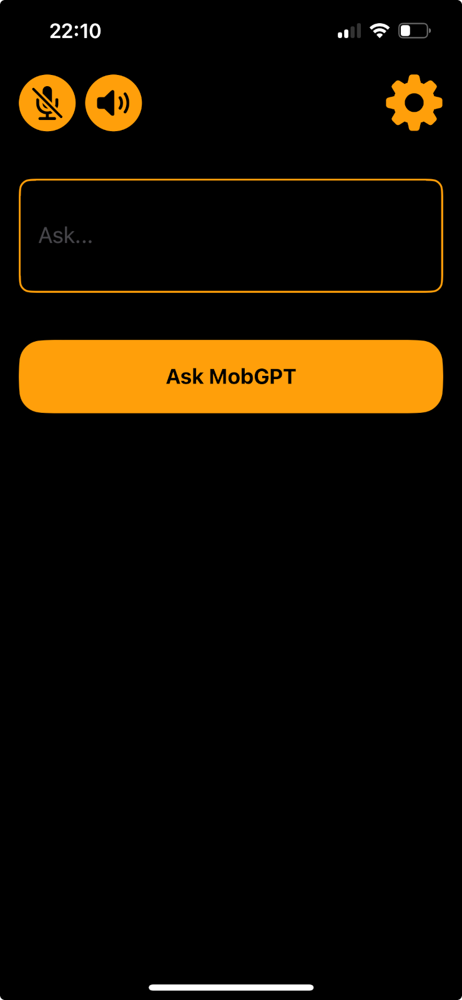
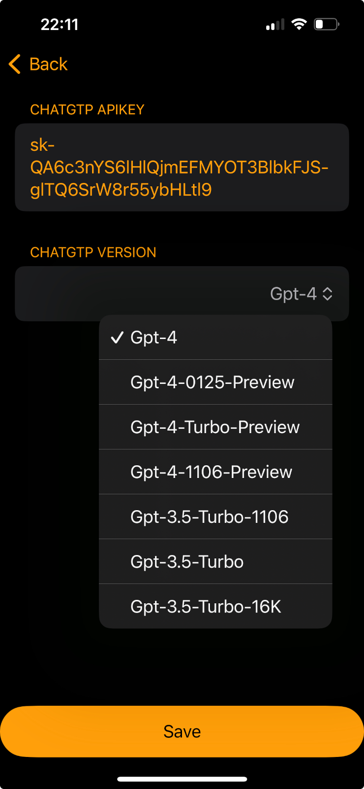
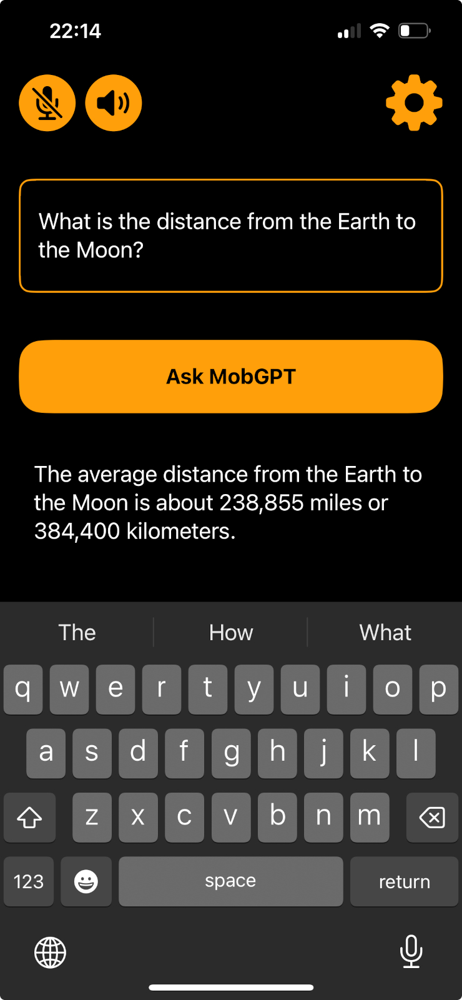
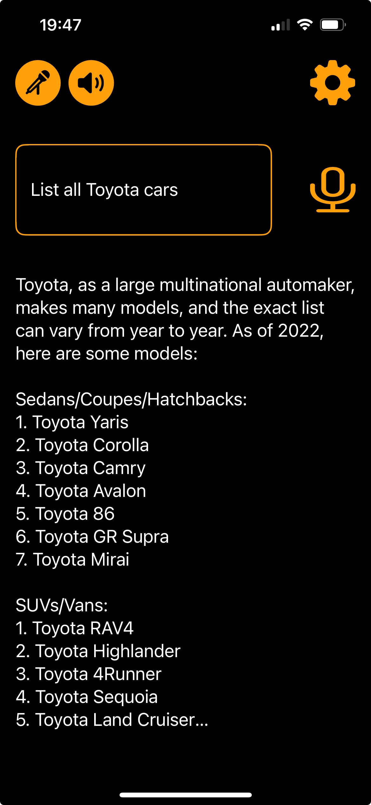
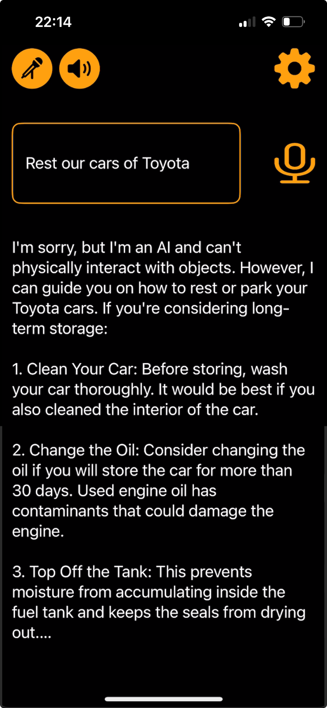

# ChatGPTTalk

ChatGPTTalk is an iOS application that serves as a demonstration of how to integrate the OpenAI ChatGPT API with speech recognition and text-to-speech modules in iOS. This is an open-source project available for download, modification, and use according to your needs. It is not available on the App Store and is intended as a learning and experimentation resource.

## Features

- **ChatGPT Conversation**: Interact with the ChatGPT chatbot using text messages.
- **Speech Recognition**: Activate the microphone and speak instead of typing. Conclude your input with "OK" to prompt the decoder to send your text to the chatbot.
- **Text-to-Speech**: The app reads aloud the responses from ChatGPT, providing an immersive audio experience.
- **Voice-to-Text Conversion**: Convert your spoken words into text for ChatGPT input.
- **Interactive UI**: A user-friendly interface with a dedicated microphone button for easy speech recognition access.

## Screenshots

Explore the app's interface and features through these screenshots:

    

## Installation

To use this project:

1. Clone or download the repository to your local machine.
2. Open the project in Xcode and configure it as needed.
3. Build and run the application on your iOS device or simulator.
